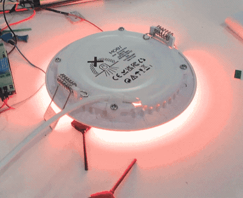
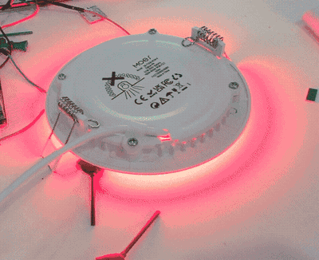

# MOES / ZT3L firmware research

> **Experimental research, not a firmware release.** The over-the-air conversion
> path works end to end, and the firmware now runs a nineteen-fixture
> installation across three rooms — through conversions from stock, mains power
> cycles and day-scale operation. It has still had no long soak and no
> independent reproduction. Use only on hardware you can recover with a
> dedicated programmer, and take a full flash backup first.

An experimental workspace for Moes RGB+CCT downlights (`TS0505B`) built on the
Tuya ZT3L module (Telink TLSR8258).

## What it looks like

Both clips are one bench fixture running the on-device light-show engine. The
effect is rendered on the chip; the network is only told *which* effect to run,
not fed a frame at a time. One group broadcast runs a whole room.

| flash | multi-scene |
| :---: | :---: |
|  |  |

Fifteen effects, a 32-step cue list the chip plays by itself, and per-fixture
phase offsets so a single broadcast becomes a chase across a room. Full
reference:
[`docs/light_show.md`](https://github.com/s0meguy1/tuyaZigbee/blob/main/docs/light_show.md).

## The hardware

The exact parts this work was done on. No affiliation, no referral codes —
they are here so you can check you have the same board before flashing anything.

- **The light** — Moes ZB-TDD6-RCW-4 RGB+CCT downlight:
  <https://www.aliexpress.us/item/3256806801178235.html>
- **The bare module** — Tuya ZT3L (Telink TLSR8258), for a spare or a repair:
  <https://www.aliexpress.us/item/3256809199488861.html>

AliExpress sellers change what a listing ships without changing the listing.
Confirm before you flash: zigbee2mqtt should report the device as `TS0505B` /
`_TZ3210_b8jdosxo`, its IEEE address should begin `0xa4c138` (a Telink chip),
and the module inside should be marked `ZT3L`.

## Start here

The firmware itself lives in a separate checkout:
**[s0meguy1/tuyaZigbee, `main`](https://github.com/s0meguy1/tuyaZigbee/tree/main)**
— a fork of [doctor64/tuyaZigbee](https://github.com/doctor64/tuyaZigbee), which
is the upstream project this work builds on.

**If you want to convert a stock device over the air, read
[`docs/moes_ts0505b_conversion.md`](https://github.com/s0meguy1/tuyaZigbee/blob/main/docs/moes_ts0505b_conversion.md)
first.**

### The one step that catches everyone

The conversion **erases NV**, and the Zigbee network credentials live in that NV.
The device therefore has to **rejoin**, and you must open permit-join *after the
install finishes*. Until you do, it looks exactly like a bricked device:
interview incomplete, every ZCL read timing out, nothing useful in the log.

It is not bricked. Zigbee2MQTT caps permit-join at 254 seconds while the transfer
takes far longer, so a window opened when you start is always gone by the time
the device needs it. This single step accounted for more lost time on this
project than any actual firmware bug.

## Status

What is established on hardware:

- **Flash layout**: app at `0x8000`, OTA staging at `0x70000`, install descriptor
  at `0xF7000`, NV at `0xD8000`.
- **Custom-to-custom OTA works.** A fixture was updated across successive builds
  keeping its address, interview and network state, with permit-join closed.
- **Stock-to-custom conversion works**, delivered by explicit per-device URL.
- **It runs as an installation, not a demo.** Nineteen fixtures in three rooms
  have been carried across successive builds over the air, including conversions
  from stock and mains power cycles. The current build reached eighteen of them
  unattended overnight; the last refused to start a transfer and is still on the
  previous build, lit and controllable. A failed transfer leaves the fixture
  running the build it already had.
- **A wired write path is validated.** A converted fixture was restored to stock
  over SWire — stock app and config written, NV and staging erased, identity and
  RF calibration untouched — and confirmed by a full read-back, then converted
  again over the air. Earlier notes here claiming SWire writes corrupt data are
  superseded.
- **The "radio silence" wedge is root-caused and is not a firmware fault.** It is
  the closed permit-join window described above.

What is **not** established:

- A long soak on the current build.
- **Any independent reproduction.** Every result here comes from one person's
  installation, on one model of fixture.
- That Zigbee command success implies light output. It does not. This misled the
  project repeatedly: a claimed output change needs visual confirmation on a
  fixture with LEDs, or direct PWM-register evidence.

The firmware checkout's `bughunt/VERIFICATION_STATUS.md` carries the detailed
evidence matrix; its README has the branch-specific warning.

## Tooling

`dump/TLSR825xComFlasher.working.py`, `dump/merge_verify.py` and
`dump/swire_diag.py` are research tools. Treat hardware interaction as read-only
unless a reviewed procedure says otherwise.

**Restoring stock onto a converted fixture**: splice the stock app and config
regions from a donor dump, **erase** the NV region rather than writing the
donor's, and never touch the bootloader or the identity/calibration region.
A donor dump carries the donor's MAC inside its NV region — writing that region
onto another board puts a duplicate MAC on your mesh.

## Privacy and repository history

Bench captures, firmware readouts, logs, session notes and per-device forensics
are deliberately kept out of this repository, and the firmware checkout has an
automated guard that fails if a full device address or a designated private
forensic note reaches the published branch.

A removal from the current index does **not** erase material already in published
history. Do not assume a later cleanup commit purges prior captures; history
rewriting or credential rotation requires explicit owner approval.
